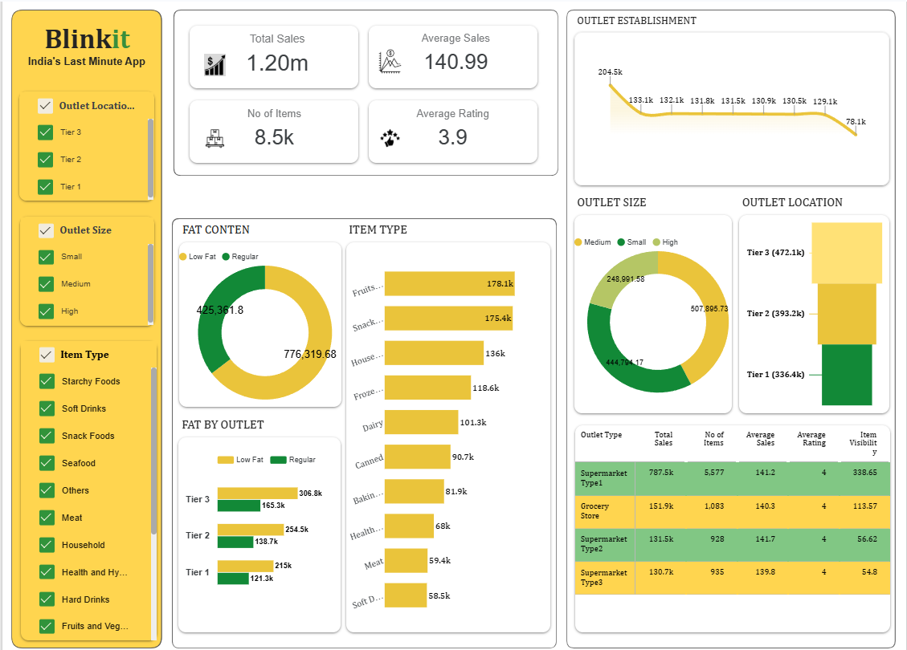

📊 Blinkit Sales & Outlet Performance Dashboard
## 📌 Project Overview
This project presents an interactive **Blinkit Sales Dashboard** built using **Google Looker Studio** The dashboard highlights key KPIs such as total sales, average sales, and item count, along with insights into outlet size, location tiers, and product categories. 

It enables stakeholders to identify high-performing outlets and optimize inventory strategy.

---

## 🎯 Problem Statement
Blinkit operates across multiple outlet types, sizes, and locations.  
The goal of this project is to:

- Analyze overall sales performance  
- Identify top-performing outlet types and locations  
- Understand product category trends  
- Evaluate customer ratings and item distribution  

---

## 🛠️ Tools & Technologies
- Data Analysis – Interpreting sales trends, outlet performance, and item distribution
- Data Cleaning – Handling inconsistencies, missing values, and formatting issues
- Data Visualization – Designing interactive dashboards using charts and KPI cards
- Business Intelligence – Translating data into actionable business insights
- Dashboard Design – Creating user-friendly and visually appealing layouts
- KPI Development – Identifying and tracking key performance indicators
- Data Storytelling – Presenting insights in a clear and meaningful way
- Google Looker Studio – Building dynamic and filter-based dashboards
- Excel / CSV Handling – Data preparation and transformation
- Analytical Thinking – Deriving insights from multiple data dimensions  

---

## 📊 Key KPIs
- 💰 Total Sales  
- 📈 Average Sales  
- 📦 Number of Items  
- ⭐ Average Rating  

---

## 📈 Dashboard Insights
- 🏆 Tier 3 outlets contribute the **highest sales**
- 🥇 Fruits and Snack Foods are **top-performing categories**
- 📦 Medium-sized outlets show **strong sales contribution**
- 🥗 Low Fat items generate **higher sales than Regular items**

---

## 🖼️ Dashboard Preview

---

## 🔗 Live Dashboard
👉 [View Looker Studio Dashboard](https://lookerstudio.google.com/s/tiDtkciGjkY)

---

## 💡 Key Learnings
- Data cleaning and transformation techniques  
- Building interactive dashboards in Looker Studio  
- KPI design and business storytelling  
- Visualizing multi-dimensional retail data  

---

## 📬 Connect with Me
- LinkedIn: (www.linkedin.com/in/perarivalan38)
- GitHub: (https://github.com/perarivalan38)

---

⭐ If you like this project, don’t forget to star the repo!
